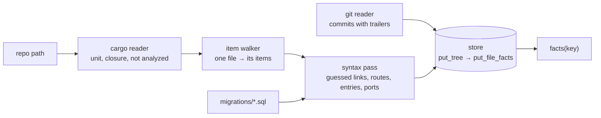

# arch-analyze

Reads a repository and writes down what is in it, one unit per repository (ADR 0007). Depends on
`arch-facts` only.

## In plain words

Think of a surveyor. Cargo tells it which building on the plot is the one to survey (the unit).
It then walks each room (source file) and notes what is there (items) and which doors lead where
(links). Today it surveys from the floor plan alone: it reads the source text and does not
type-check it. That is fast and needs no build, but a door it cannot follow on paper is left
out, and every door it does note is marked `guessed`. A second surveyor that walks the building
(rust-analyzer, issue #3) will confirm and complete the notes.



## Entry points

```rust
// Repo path in, facts out. Options::default() is the syntax-level pass.
let facts = arch_analyze::analyze(repo, &Options::default())?;
// Same, into a store the caller keeps; returns the key the facts are under.
let key = arch_analyze::index(repo, &options, &mut store)?;
```

```
cargo run -p arch-analyze --example emit-facts -- <repo> [--name <n>] [--commit <hash>] [--no-commits]
```

## What the syntax-level pass produces, and how it guesses

Every link has `confidence: guessed` and a `reason` naming the mechanism. Every analyzed crate is
listed in `analyzer.degraded` with `syntax-level pass: not type-checked` (plus cargo's error when
`cargo metadata` failed and the manifests were read by hand), so findings on these facts warn and
never block (ADR 0009, ADR 0010).

| fact | how it is found | what is missed |
|---|---|---|
| unit, crates | `cargo metadata --no-deps`: first `[[bin]]` (default members first), else the lib; `areas.toml` `main_bin` overrides; closure = the package's lib and workspace libs reached by path dependencies | targets of other packages are listed, never walked |
| items | every item in the syntax tree of a file reachable through `mod` declarations, with `parent` for associated items | items a macro generates |
| `calls`, `constructs`, `uses-type`, `holds`, `implements`, `refines`, `matches-on`, `re-exports`, `refers-to` | a written path followed through the unit's modules and `use` declarations (globs up to five levels) | names std's prelude or a glob over an external crate brings in |
| `calls`, `calls-port`, `reads` (fields) through a method or field | only when the receiver's type is written: `self`, a field, a parameter, a `let` with a type or a constructor call | receivers whose type is inferred |
| links inside macro arguments | the arguments are parsed again as a function body | arguments that are not expressions |
| `calls-out`, `inherits`, `decorates`, `expands` to a crate | a path whose first segment is a declared dependency; the external is the cargo package | items reached through a re-export in another crate are named by the path as written |
| `routes`, driving http ports, framework entries | axum `Router::route` with `get(h)`…, actix `App::route` with `web::get().to(h)` and `#[get("/x")]`; scope and `nest` prefixes; middleware from `layer`/`route_layer`/`wrap`, outermost first | routers assembled across functions |
| `hands-off`, spawned-worker entry | `tokio::spawn(f(..))` and its siblings; the ADR 0028 rule on the direct-call graph | spawns of closures with more than one call |
| tables, `reads`/`queues` on tables, `Table.queue` | `CREATE TABLE` in `migrations/*.sql`; SQL text given to `sqlx::query*`; `FOR UPDATE SKIP LOCKED` marks a dequeuer | SQL built at run time |
| `wires` | a type implementing one of the unit's traits is built and passed on as an argument | wiring through a container or macro |
| http externals | a `reqwest` verb call on a client whose type is written; the host comes from a URL literal in the file, else the module's name | hosts that come from configuration |

## Ids

`<crate>::<module>::<name>#<kind>`; an `impl` is `impl <Trait> for <Type>#impl`; an associated
item is `<parent id without #kind>::<name>#<kind>`. Items of the lib carry the crate name; items
of another target carry `<crate>[<kind>:<target>]`, e.g. `orderly[bin:orderly]::main#fn`
(provisional, arch-design issue 22).

## Store flow and recompute

`index` records the tree (`put_tree`), then writes one `FileFacts` per file of the tree; files
that are not sources of the unit get an empty delta, so `missing_file_facts` is empty afterwards.
The syntax-level pass recomputes the whole unit on each call and overwrites the deltas, because
a file's links depend on other files (arch-design issue 21). Ports, externals and entries are
stored with the file their witness names.

## Open questions filed in arch-design (`from:arch`)

| question | provisional reading in code | issue |
|---|---|---|
| a file's facts are not a function of that file alone | recompute the unit, overwrite deltas | arch-design#21 |
| id of an item in a non-lib target | `<crate>[bin:<name>]::…` | arch-design#22 |
| what "cannot type-check" means | cargo failure is recorded; the trigger list waits for the rust-analyzer pass | arch-design#23 |
| the entry kind for a spawned worker (ADR 0028) | entry emitted with `framework` absent until `Entry` has a kind | arch issue "arch-facts: Entry needs a kind" |
