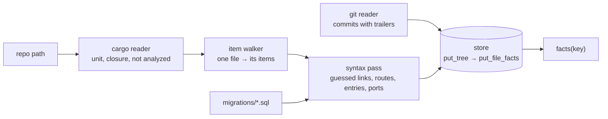
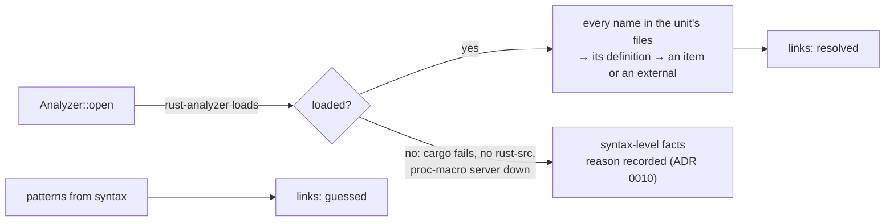

# arch-analyze

Reads a repository and writes down what is in it, one unit per repository (ADR 0007). Depends on
`arch-facts` only.

## In plain words

Think of a surveyor. Cargo tells it which building on the plot is the one to survey (the unit).
It then walks each room (source file) and notes what is there (items) and which doors lead where
(links). By default it surveys from the floor plan alone: it reads the source text and does not
type-check it. That is fast and needs no build, but a door it cannot follow on paper is left
out, and every door it does note is marked `guessed`. A second surveyor walks the building:
rust-analyzer type-checks the code, and the doors it confirms are marked `resolved`.



## Entry points

```rust
// Repo path in, facts out. Options::default() is the syntax-level pass.
let facts = arch_analyze::analyze(repo, &Options::default())?;
// Same, into a store the caller keeps; returns the key the facts are under.
let key = arch_analyze::index(repo, &options, &mut store)?;
```

```
cargo run -p arch-analyze --example emit-facts -- <repo> [--name <n>] [--commit <hash>] [--no-commits] [--resolved]
```

## Two depths

| | `Depth::Syntax` (default) | `Depth::Resolved` |
|---|---|---|
| needs | the source files | a cargo project that resolves, `rust-src`, a built `target/` for speed |
| links | all `guessed`, each with its reason | from rust-analyzer's type-checked view: `resolved`, no reason |
| pattern links (routes, hand-offs, SQL, wiring, HTTP hosts, derives and attribute macros) | `guessed` | still `guessed`: a pattern is not a type-checked fact |
| `analyzer.degraded` | every analyzed crate, `syntax-level pass: not type-checked` | empty; or every analyzed crate with `rust-analyzer could not load the repository: <why>` |
| smallsvc | 0.3 s, 928 links | 3.7 s first index, 0.35 s after one file changes, 983 links (888 resolved) |

`Depth::Resolved` loads rust-analyzer (the `ra_ap_*` crates, pinned to one exact version) once
and keeps it: `Analyzer::open`, then `index`, then `file_changed` + `index` for each change.



How a name becomes a link at this depth: each identifier in a file of the unit is classified by
rust-analyzer (inside macro calls and attribute-macro input, through its expansion); the
definition is mapped back to the walker's item by the position of its name, or to the external
crate that owns it (a crate reached only through another one is named from `Cargo.lock`); the
same name-in-context table as the syntax pass picks the link kind. Definitions a macro generated
and anything in std are not targets.

One honest consequence: degrade is all-or-nothing for the unit today, not per crate. A unit is
one package and the workspace libs it reaches, and rust-analyzer loads them together; per-crate
degrade needs a per-crate signal that it does not expose through this API.

Budgets (ADR 0026) are benchmarks with thresholds: `cargo bench -p arch-analyze` runs
`first_index_cold` (< 5 s) and `recompute_one_file` (< 500 ms) on smallsvc and fails when one is
crossed.

## What the syntax-level pass produces, and how it guesses

Every link has `confidence: guessed` and a `reason` naming the mechanism. Every analyzed crate is
listed in `analyzer.degraded` with `syntax-level pass: not type-checked` (plus cargo's error when
`cargo metadata` failed and the manifests were read by hand), so findings on these facts warn and
never block (ADR 0009, ADR 0010).

| fact | how it is found | what is missed |
|---|---|---|
| unit, crates | `cargo metadata --no-deps`: first `[[bin]]` (default members first), else the lib; `areas.toml` `main_bin` overrides; closure = the package's lib and workspace libs reached by path dependencies | targets of other packages are listed, never walked |
| items | every item in the syntax tree of a file reachable through `mod` declarations, with `parent` for associated items | items a macro generates |
| `calls`, `constructs`, `uses-type`, `holds`, `implements`, `refines`, `matches-on`, `re-exports`, `refers-to` | a written path followed through the unit's modules and `use` declarations (globs up to five levels) | names std's prelude or a glob over an external crate brings in |
| `calls`, `calls-port`, `reads` (fields) through a method or field | only when the receiver's type is written: `self`, a field, a parameter, a `let` with a type or a constructor call | receivers whose type is inferred |
| links inside macro arguments | the arguments are parsed again as a function body | arguments that are not expressions |
| `calls-out`, `inherits`, `decorates`, `expands` to a crate | a path whose first segment is a declared dependency; the external is the cargo package | items reached through a re-export in another crate are named by the path as written |
| `routes`, driving http ports, framework entries | axum `Router::route` with `get(h)`…, actix `App::route` with `web::get().to(h)` and `#[get("/x")]`; scope and `nest` prefixes; middleware from `layer`/`route_layer`/`wrap`, outermost first | routers assembled across functions |
| `hands-off`, spawned-worker entry | `tokio::spawn(f(..))` and its siblings; the ADR 0028 rule on the direct-call graph | spawns of closures with more than one call |
| tables, `reads`/`queues` on tables, `Table.queue` | `CREATE TABLE` in `migrations/*.sql`; SQL text given to `sqlx::query*`; `FOR UPDATE SKIP LOCKED` marks a dequeuer | SQL built at run time |
| `wires` | a type implementing one of the unit's traits is built and passed on as an argument | wiring through a container or macro |
| http externals | a `reqwest` verb call on a client whose type is written; the host comes from a URL literal in the file, else the module's name | hosts that come from configuration |

## Ids

`<crate>::<module>::<name>#<kind>`; an `impl` is `impl <Trait> for <Type>#impl`; an associated
item is `<parent id without #kind>::<name>#<kind>`. Items of the lib carry the crate name; items
of another target carry `<crate>[<kind>:<target>]`, e.g. `orderly[bin:orderly]::main#fn`
(provisional, arch-design issue 22).

## Store flow and recompute

`index` records the tree with one `FileFacts` per file of the tree (`put_tree`); files that are
not sources of the unit get an empty delta, so `missing_file_facts` is empty afterwards. It then
points the worktree at the tree (`set_worktree`), which forgets the state the worktree left.
The pass still recomputes the whole unit on each call.

Each delta is stored under its facts key (ADR 0002): `hash(path · content hash · package id)`.
The package id is computed in-process (`package`), in git's object format, from the bytes `index`
reads anyway: the package directory's tree id, as `git write-tree` gives it for the working files
(`git rev-parse <commit>:<dir>` once committed), combined with the tree ids of the unit packages
it depends on (transitively), the `Cargo.lock` blob id, and the analyzer's inputs (version,
effective depth, unit, degraded crates). A Rust file is keyed by the packages whose crates walk
it; any other file by its innermost package, or the unit's id outside every package. Why not a
`git` process: a temporary index with `git add -A` and `git write-tree` took 28–41 ms for 101
files and writes loose objects into the repository on every save. Known gap: submodules and
symlinks to directories are not among the files read, so a tree holding them gets another id
than git's.

A delta holds what its file declares and the links it makes, plus the file's *notes* (opaque to
the store): routes, spawns, SQL touches, crate paths, HTTP hosts and terminal writes, tests,
endless loops, created tables. Facts that need more than one file's body are derived from every
delta's notes when the tree is recorded (`assemble::derive`, ADR 0002) and stored on the tree,
not in a delta: entries, ports, externals, tables with their queue use, and an inserter's
`queues` link. So a file's delta is the same whatever the other files' bodies say. Where several
files offer the same fact (one entry per item, one port per name, one witness per host), the
first in the pass's visit order wins, as each note records its place in it.

## Open questions filed in arch-design (`from:arch`)

| question | provisional reading in code | issue |
|---|---|---|
| a file's facts are not a function of that file alone | recompute the unit, overwrite deltas; facts that span files derived at assembly | decided: ADR 0002 (arch-design#21); the per-file key and recompute land in #59 |
| id of an item in a non-lib target | `<crate>[bin:<name>]::…` | arch-design#22 |
| what "cannot type-check" means | the load fails: cargo cannot describe the workspace, `rust-src` is missing, or the proc-macro server does not start | arch-design#23 |
| entries (ADR 0028) | `main`, framework-held handlers, spawned workers; a test is not an entry (its `tests` links carry what it exercises). `main` and a worker spawned in `main`'s body are `resolved` at resolved depth; routes are patterns and stay `guessed` | decided: ADR 0028 |
