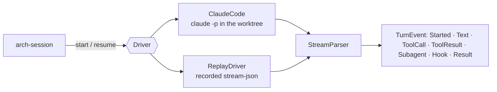

# arch-driver

The `Driver` trait and its first adapter, `claude-code` (ADR 0012, HANDOFF §2). A driver runs an
agent CLI in a session's worktree and streams one turn back as `TurnEvent`s. The tool layer
(`arch hook pre|post`, MCP tools) is #46.



## The trait

Each turn is one process. `start(task, context)` opens a driver session, and arch chooses its id
(a v4 uuid) so the ADR 0003 pointer is known before the first event. `resume(session_id, task,
context)` continues that session with `task.prompt` as the message: an answer to an ask, a fix
round, or a restart (arch-design#33, option A). Both take the task and context again because nothing
but the driver's session survives between processes. `interrupt` (SIGINT) and `stop` (SIGKILL)
live on the turn's `TurnHandle` rather than the trait, so another thread can stop a turn while the
scheduler iterates it.

| type | what |
|---|---|
| `Task` | prompt, worktree, `tools` (the built-in set the agent has at all), `allowed_tools` (approved without a prompt), `output_schema` (planner, judge), model, max turns |
| `Context` | paths arch wrote: the context pack, the settings with hooks, the MCP config |
| `Turn` | the session id, then the events; `finish()` drains to the `TurnResult` |
| `TurnResult` | ok, subtype (`success`, `error_max_turns`, …), text, structured output, turns, cost, denied tools |

## The claude-code command line

FINDINGS F-1 (no `--bare`), F-4 (no `--no-session-persistence`) and F-5 (`--tools` restricts and
`--allowedTools` only approves):

```
claude -p --output-format stream-json --verbose --include-hook-events
       --setting-sources '' --strict-mcp-config
       --session-id <uuid>            # or --resume <uuid>
       [--model m] [--settings hooks.json] [--mcp-config arch.json]
       [--append-system-prompt-file pack.md]
       [--tools Read,Edit,…] [--allowedTools Read,mcp__arch__commit,…]
       [--json-schema '{…}'] [--max-turns n]
       --permission-mode acceptEdits --permission-prompts none
       < prompt on stdin
```

The prompt goes in on stdin because `--tools` and `--allowedTools` take several values and would
swallow a positional prompt. The transcript is at
`${CLAUDE_CONFIG_DIR:-~/.claude}/projects/<canonical cwd, non-alphanumerics as ->/<id>.jsonl`
(`transcript_path`). One honest consequence of option A: arch's runs appear in Claude Code's
history for that worktree.

## The parser

Lenient on purpose, because the CLI adds line types between releases. A non-JSON line is skipped,
a type the parser does not read is counted as `unknown`, and neither fails the turn
(`StreamStats`). Shapes are pinned by recordings from Claude Code 2.1.272 in
`crates/arch-driver/tests/fixtures/`:

| fixture | shows |
|---|---|
| `text` | init, one text, a success result |
| `tools` | Read then Edit, with PreToolUse/PostToolUse hook events |
| `denied` | a PreToolUse hook's exit 2: the reason reaches the model as an error tool result and appears in `permission_denials` |
| `subagent` | an `Agent` call, `task_started`, then the sub-agent's events with `parent_tool_use_id` |
| `resume` | `--resume` of `text`: same session id |
| `structured` | `--json-schema`: `structured_output` in the result |
| `max-turns` | `error_max_turns`, `is_error: true` |

`experiments/record-stream.sh` re-records them (a few cents on haiku). It replaces the scratch
path, `$HOME`, ids, account usage and thinking signatures with placeholders.

## Tests

- `cargo test -p arch-driver`: the parser over every fixture, the argv pinned, the adapter against a
  stub binary (stdin, cwd, chosen id, resume, exit without a result, missing binary, stop), and the
  replay double driving a consumer.
- Opt-in, real CLI, never in default CI (needs a Claude Code login):

  ```sh
  ARCH_SMOKE_CLAUDE=1 cargo test -p arch-driver --test smoke -- --ignored
  ```

  It checks that `--session-id` is honoured, `--tools` restricts the set, the transcript exists, and
  `--resume` remembers the first turn. `ARCH_SMOKE_MODEL` overrides `haiku`.
