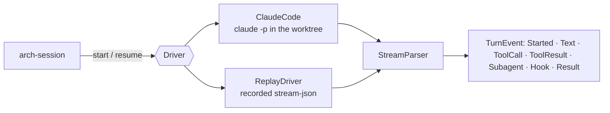
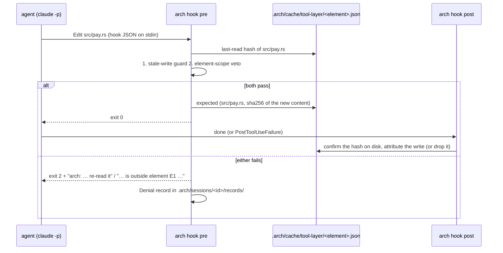

# arch-driver

The `Driver` trait and its first adapter, `claude-code` (ADR 0012, HANDOFF §2). A driver runs an
agent CLI in a session's worktree and streams one turn back as `TurnEvent`s. The tool layer
(`arch hook pre|post`, MCP tools; #46) is the agent's only confinement: see
[The tool layer](#the-tool-layer).



## The trait

Each turn is one process. `start(task, context)` opens a driver session, and arch chooses its id
(a v4 uuid) so the ADR 0003 pointer is known before the first event. `resume(session_id, task,
context)` continues that session with `task.prompt` as the message: an answer to an ask, a fix
round, or a restart (arch-design#33, option A). Both take the task and context again because nothing
but the driver's session survives between processes. `interrupt` (SIGINT) and `stop` (SIGKILL)
live on the turn's `TurnHandle` rather than the trait, so another thread can stop a turn while the
scheduler iterates it.

| type | what |
|---|---|
| `Task` | prompt, worktree, `tools` (the built-in set the agent has at all), `allowed_tools` (approved without a prompt), `output_schema` (planner, judge), model, max turns |
| `Context` | paths arch wrote: the context pack, the settings with hooks, the MCP config |
| `Turn` | the session id, then the events; `finish()` drains to the `TurnResult` |
| `TurnResult` | ok, subtype (`success`, `error_max_turns`, …), text, structured output, turns, cost, denied tools |

## The claude-code command line

FINDINGS F-1 (no `--bare`), F-4 (no `--no-session-persistence`) and F-5 (`--tools` restricts and
`--allowedTools` only approves):

```
claude -p --output-format stream-json --verbose --include-hook-events
       --setting-sources '' --strict-mcp-config
       --session-id <uuid>            # or --resume <uuid>
       [--model m] [--settings hooks.json] [--mcp-config arch.json]
       [--append-system-prompt-file pack.md]
       [--tools Read,Edit,…] [--allowedTools Read,mcp__arch__commit,…]
       [--json-schema '{…}'] [--max-turns n]
       --permission-mode acceptEdits --permission-prompts none
       < prompt on stdin
```

The prompt goes in on stdin because `--tools` and `--allowedTools` take several values and would
swallow a positional prompt. The transcript is at
`${CLAUDE_CONFIG_DIR:-~/.claude}/projects/<canonical cwd, non-alphanumerics as ->/<id>.jsonl`
(`transcript_path`). One honest consequence of option A: arch's runs appear in Claude Code's
history for that worktree.

## The parser

Lenient on purpose, because the CLI adds line types between releases. A non-JSON line is skipped,
a type the parser does not read is counted as `unknown`, and neither fails the turn
(`StreamStats`). Shapes are pinned by recordings from Claude Code 2.1.272 in
`crates/arch-driver/tests/fixtures/`:

| fixture | shows |
|---|---|
| `text` | init, one text, a success result |
| `tools` | Read then Edit, with PreToolUse/PostToolUse hook events |
| `denied` | a PreToolUse hook's exit 2: the reason reaches the model as an error tool result and appears in `permission_denials` |
| `subagent` | an `Agent` call, `task_started`, then the sub-agent's events with `parent_tool_use_id` |
| `resume` | `--resume` of `text`: same session id |
| `structured` | `--json-schema`: `structured_output` in the result |
| `max-turns` | `error_max_turns`, `is_error: true` |

`experiments/record-stream.sh` re-records them (a few cents on haiku). It replaces the scratch
path, `$HOME`, ids, account usage and thinking signatures with placeholders.

## The tool layer

ADR 0012: Claude Code calls `arch hook pre` before a write and `arch hook post` after it; arch
also hands the agent an MCP server. Everything works on one element of one session, in its
worktree (`tool_layer::Scope`, loaded from `.arch/sessions/<id>/plan.toml`).



| piece | where | what |
|---|---|---|
| `guard::pre` | pure | stale-write guard (an existing file must have this element's last-read hash; never read → "read it first", changed → "re-read it"; a new file passes), then the element-scope veto (the worktree-relative path is in `element.files`), then the expected content (`Write` carries it; `Edit` is old → new on the current file) |
| `guard::bash` | pure | `Bash` may run `cargo check · build · test · clippy`, `cargo fmt --check`, read-only git (`status diff log show blame ls-files rev-parse`), piped into `head tail grep wc`; no redirection, substitution, `--config`, `--output`. `git commit` / `git push` are denied by name (ADR 0016, 0017) |
| `guard::post` | pure | `Read` records the hash; a write confirms the hash on disk and is attributed; a failed write drops what the disk does not hold |
| `hook::run` | stdin, state file, records | the guard around one call; a failure is an `Err` the CLI turns into exit 2 (fail closed) for `pre`, exit 1 for `post` |
| `mcp::McpServer` | stdio | JSON-RPC 2.0, one message per line: `initialize`, `ping`, `tools/list`, `tools/call` |
| `commit::commit` | git | the commit tool |
| `config` | files | `--settings` and `--mcp-config`, both running `std::env::current_exe()` |

The tool-layer state file is an `.arch/` format owned by arch-facts (`ToolLayerState`); the watcher
reads its `expected` list to tell the session's writes from yours. Every update holds a lock on
`<element>.lock` and replaces the file atomically: hooks and the MCP server are separate processes.

### The MCP tools

Claude Code names them `mcp__arch__<tool>` (the server is `arch` in the MCP config;
`mcp::TOOLS` lists them for `--allowedTools`).

| tool | input | returns |
|---|---|---|
| `read` | `path` | `<path> · sha256 <hex>`, then the content; records the hash, so a later write passes the guard |
| `check` | — | `arch check` on the worktree, the `schemas/check.schema.json` document, through the `Project` port (arch-api implements it: this crate may not depend on arch-analyze) |
| `commit` | `type`, `summary`, `body?` | `committed <hash> · <files>` and the subject. Only the element's files go in (`git commit --only`), whatever else is staged; `type(area): summary`, the area from `areas.toml` through the port; body defaults to the intention; trailers `Arch-Element`, `Arch-Session`, `Co-authored-by`. While HEAD carries this element's trailers, a second call amends it |
| `ask` | `questions[{text, options}]` | `wait`; an `Ask` entry (author: the element's agent) is appended to `thread.jsonl`, and the agent ends its turn |

A tool's own failure (a bad type, nothing to commit, a path out of the worktree) is a result with
`isError: true` and the reason, so the model can act on it; an unknown method or tool is a
JSON-RPC error.

### What the driver is given

`config::write_context(&ToolLayerArgs { exe, worktree, session, element }, pack)` writes both
files under `<worktree>/.arch/cache/driver/<element>/` and returns the `Context`:

```json
{ "hooks": {
    "PreToolUse":         [{ "matcher": "Edit|Write|MultiEdit|NotebookEdit|Bash", "hooks": [{ "type": "command", "command": "'/…/arch' 'hook' 'pre' '--worktree' '/…/repo-w1' '--session' 's-1' '--element' '3f2a9c1e'" }] }],
    "PostToolUse":        [{ "matcher": "Read|Edit|Write|MultiEdit|NotebookEdit", "hooks": [{ "…": "hook post" }] }],
    "PostToolUseFailure": [{ "matcher": "Edit|Write|MultiEdit|NotebookEdit", "hooks": [{ "…": "hook post" }] }] },
  "permissions": { "allow": ["mcp__arch__read", "…", "Bash(cargo test:*)", "…"],
                   "deny": ["Bash(git commit:*)", "Bash(git push:*)"] } }
```

```json
{ "mcpServers": { "arch": { "type": "stdio", "command": "/…/arch",
    "args": ["mcp", "--worktree", "/…/repo-w1", "--session", "s-1", "--element", "3f2a9c1e",
             "--co-author", "Claude <noreply@anthropic.com>"] } } }
```

The hooks are the confinement; the permissions only settle up front what the hook would decide.
`Task.tools` (FINDINGS F-5) is still what keeps tools like `Agent` or `WebFetch` out.

One honest consequence: a write the agent makes outside Edit/Write (none today, since `Bash` cannot
write) would have no expected entry and the watcher would report it as `you` (ADR 0012).

## Tests

- `cargo test -p arch-driver`: the parser over every fixture, the argv pinned, the adapter against a
  stub binary (stdin, cwd, chosen id, resume, exit without a result, missing binary, stop), and the
  replay double driving a consumer.
- `cargo test -p arch-driver --test tool_layer`: the pre hook as a table (in scope + fresh, out of
  scope, changed since read, never read, new file in scope, out of the worktree, `git commit` and
  `git push` in Bash), the post hook, the hooks on a temp worktree (Denial record, expected before
  the write), the commit tool on a temp repo (message, trailers, staged set, amend), an MCP round
  trip for each tool, and the generated files. `arch-cli`'s `tests/tool_layer.rs` runs the same
  through the binary, as separate processes, with the real `check()` on smallsvc.
- Opt-in, real CLI, never in default CI (needs a Claude Code login):

  ```sh
  ARCH_SMOKE_CLAUDE=1 cargo test -p arch-driver --test smoke -- --ignored
  ```

  It checks that `--session-id` is honoured, `--tools` restricts the set, the transcript exists, and
  `--resume` remembers the first turn. A second test builds `arch`, hands it to a real session as
  hooks and MCP server, and checks that arch's four tools are up, an Edit outside the element is
  blocked by `arch hook pre` with the reason, the model reports it, and a Denial record exists. `ARCH_SMOKE_MODEL` overrides `haiku`.
