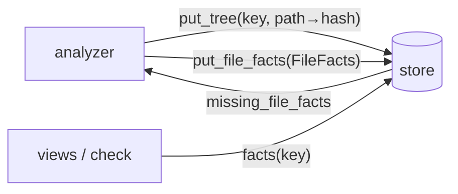

# arch-facts

The fact model, the store and the `.arch/` formats. Depends on nothing else of ours.

## `schemas/facts.schema.json`

The contract between `arch-analyze` (producer), `arch-fixtures` (golden files, reviewed there
first) and `arch-views` (reader). It is **generated from the Rust types** in
`crates/arch-facts/src/model.rs`; the committed file is the published artifact and CI fails when it
drifts (`cargo test -p arch-facts`). Regenerate with:

```
ARCH_UPDATE_SCHEMA=1 cargo test -p arch-facts
```

`schemas/examples/*.json` must validate against the schema and round-trip through the types
byte for byte; they are the smallest examples arch-fixtures can start from.

### Versioning

`schema_version` is `0` until the first golden facts are pinned (issue #9). After that, any change
a reader could notice (a removed field, a renamed enum value, a new required field) bumps it and is
announced in arch-design before it ships (HANDOFF §5). Adding an optional field does not bump.

### Stability rules for golden comparison

- Every array is sorted: items, ports, externals, tables, crates by `id`/`name`; links by
  `from`, `to`, `kind`; entries by `item`; commits by history order.
- Item ids never contain line numbers (`<crate>::<module>::<name>#<kind>`), so positions stay
  byte-identical when unrelated lines move (MAP-1).
- Empty flags, empty arrays and absent options are omitted.

### Decisions encoded (spec §13 = ADR *n*)

| ADR | where |
|---|---|
| 2 keys by commit / worktree-state hash | `Repo.commit` (`wt:` prefix for uncommitted trees) |
| 7 one unit, main bin or lib | `Unit.main_target`, `Crate.status` |
| 9 confidence resolved · guessed · declared | `Confidence`, `Link.confidence` |
| 10 degrade to syntax-only facts, reason recorded | `Analyzer.degraded` |
| 16 commits as facts with trailers | `Commit`, `Trailer` |
| 21 content-addressed element ids | `Commit.element` |

Open: the link-kind list (FINDINGS F-3, issue #10).

## Store and `.arch/` formats

Second PR of issue #1: sqlite under `.arch/cache/`, per-file deltas keyed by content hash,
branch pointers, `areas.toml` · `rules` · `allows` · `sessions/<id>/` readers and writers, the
`refs/notes/arch` archive, event types.

## Store (ADR 0001, 0002, 0020)

`crates/arch-facts/src/store/` is the only place SQL lives. `Store::open(<.arch>)` creates
`.arch/cache/facts.sqlite`; the cache is disposable and rebuilt from the repo (a store with an
older `schema_version` in `meta` is dropped and recreated).

| table | what | ADR |
|---|---|---|
| `file_facts` | one file's facts at one content hash (`FileFacts` as JSON): the per-file delta | 0002 |
| `trees`, `tree_files` | a commit or a worktree state → its files at their hashes, plus its `TreeHead` (repo, analyzer, crates) | 0002, 0007, 0010 |
| `commits`, `tree_commits` | commits as facts, and which are on a tree's branch | 0016 |
| `branches`, `worktrees` | pointers: branch → head; worktree → state hash, base commit, branch | 0002 |
| `view_cache` | per-branch view payloads, tagged with the tree they were computed at | views |
| `plan_drafts` | plans until Accept; discard deletes | 0020 |

The flow the analyzer follows: `put_tree(key, files)` → `missing_file_facts(key)` tells it which
files to compute → `put_file_facts` per file → `facts(key)` assembles the document, sorted per the
stability rules above. A rebase or a second worktree on the same base needs no recompute: deltas
are shared by file hash. `tests/golden.rs` proves the round trip on `schemas/examples/*.json` and
on every pinned `golden/<repo>/facts.json`.



## `.arch/` formats (spec §7; ADR 0003, 0004, 0021)

`ArchDir::of_repo(root)` reads and writes the committed files; everything is plain text.

| file | type | content |
|---|---|---|
| `areas.toml` | `Areas` | overrides only: `rule`, `main_bin`, `[[area]] name · paths · side · order` |
| `areas/<name>.md` | text | one description per area, read into the context pack |
| `rules` | `Rules` | TOML: `[[rule]] subject · must_not · targets · level`, `[lints] name = bool`; `Rules::v1_template()` is ADR 0006 |
| `allows` | `Allows` | TOML: `[[allow]] site · rule · reason · by · at` |
| `sessions/<id>/plan.toml` | `Plan` | elements (`ElementId` = `sha256(session · intention · site)[:8]`, label `E<n>`), groups, gates |
| `sessions/<id>/thread.jsonl` | `ThreadEntry` per line | arch's own thread; driver session id and transcript path as pointers |
| `sessions/<id>/records/NNNN-<kind>.toml` | `Record` | gate-output · judge-verdict · denial · override · resolution, each with witnesses |
| `refs/notes/arch` | `Archive` | at merge, `Archive::move_to_notes` writes the folder as one TOML note and removes it from the tree |

## Open questions filed in arch-design (`from:arch`)

Where an ADR leaves a wire detail open, the code carries the simplest reading and the question is
filed; the product chat decides, then the code follows.

| question | provisional reading in code | issue |
|---|---|---|
| ADR 0021: byte encoding of the element-id hash input | UTF-8 of `session`, `intention`, `site` joined by NUL; sha256 hex; first 8 chars | arch-design#18 |
| ADR 0003: which commit the archive note attaches to, and its encoding | caller passes the merge commit on main; one TOML note with `[[file]] path · content` | arch-design#19 |
| `.arch/rules` and `.arch/allows` shapes, the five lints | TOML as in the table above; lints `god-module · cycle · leaky-port · speculative-abstraction · unresolved-dyn` from the flow pages | arch-design#4 (from:fixtures) |
| the 21 link kinds | `LinkKind` as published | arch-design#16 |
