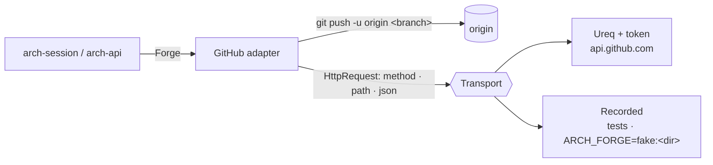

# arch-forge

The `Forge` trait and its first adapter, GitHub (ADR 0018, HANDOFF §2). arch-session and arch-api
use it to push the session branch, open the PR, find it again, read its checks and reviewers, and
merge it with a strategy the repo allows. Nothing in the trait names GitHub; the UI's words
(`PR`, `checks`) come from the adapter, so a GitLab adapter (V1.x) says `MR` and `pipeline`.



## The trait

| method | what | GitHub |
|---|---|---|
| `push(branch)` | the person's click (ADR 0017) | `git push -u origin <branch>` |
| `create_pr(NewRequest)` | pushes `head`, then opens the request | push, then `POST /repos/{o}/{r}/pulls` |
| `pr(branch)` | the branch's request, open, closed or merged (the open one when several) | `GET …/pulls?head={o}:{branch}&state=all` |
| `checks(pr)` | CI results on the request's head | `GET …/commits/{sha}/check-runs` + `GET …/commits/{sha}/status` |
| `reviewers(pr)` | who is asked or reviewing, and their latest verdict | `GET …/pulls/{n}/requested_reviewers` + `GET …/pulls/{n}/reviews` |
| `merge(pr, strategy)` | merges, refused if the head moved past `pr.head_sha` | `PUT …/pulls/{n}/merge {merge_method, sha}` |
| `strategies()` | what the repo allows: read, never chosen in arch (ADR 0016) | `GET /repos/{o}/{r}`: `allow_merge_commit` · `allow_squash_merge` · `allow_rebase_merge` |
| `request_word()` · `checks_word()` | UI words | `PR` · `checks` |

`create_pr` pushes because ADR 0017 puts the push on create PR: a caller cannot open a request
for a branch the forge has never seen. Agents never push; the tool layer denies `git push` (#46).

| type | values |
|---|---|
| `Request` | number · url · title · head · base · head sha · draft · state `Open \| Closed \| Merged` |
| `Check` | name · state `Pending \| Passed \| Failed \| Skipped` · url |
| `Reviewer` | name (`org/team` for a team) · team · state `Requested \| Approved \| ChangesRequested \| Commented` |
| `Strategy` | `Merge \| Squash \| Rebase` |
| `ForgeError` | `NoToken` · `NotGitHub` · `Push` · `Rejected { status, message }` · `Transport` · `Decode` |

### Checks

Check-runs (GitHub Actions) and commit statuses (many external CIs) are merged into one list.
A check-run that is not `completed` is pending; `success` passes; `neutral` and `skipped` are
skipped; anything else (failure, timed out, cancelled, action required) fails. A status is
`success`, `pending`, or failed (`failure`, `error`). GitHub's combined status reads `pending`
when a commit has no statuses at all, so it is never used. `summary(&checks)` folds the list:
any failed → failed, else any pending → pending, else passed.

### Reviewers

Requested people come first, then everyone who reviewed, in order of their first review, then
requested teams. A person still in `requested_reviewers` is `Requested` whatever they said before
(a re-request). Otherwise the latest approval or change request wins; a later comment does not undo
it, a dismissal does. `PENDING` reviews (a draft nobody else sees) are ignored.

### Errors

Any non-2xx answer is `Rejected { status, message }` with GitHub's `message` (and a 422's
validation details). Merging with a strategy the repo does not allow is a 405. Merging after the
head moved is a 409. Both surface through the status bar and the Checks row, never a modal
(ADR 0023).

## Repository and token

`GitHub::open(workdir)` reads owner and repo from `git remote get-url origin`: `https://github.com/o/r(.git)`
(credentials in the URL are ignored), `git@github.com:o/r(.git)`, or `ssh://git@github.com(:port)/o/r(.git)`.
Any other host is `NotGitHub`.

The token is resolved once, when the transport is built, in this order. A source that is unset,
empty, missing or failing gives way to the next:

| # | source |
|---|---|
| 1 | `GITHUB_TOKEN` |
| 2 | `GH_TOKEN` |
| 3 | the OS keychain entry service `arch`, account `github`: `security find-generic-password -s arch -a github -w` (macOS), `secret-tool lookup service arch account github` (Linux) |
| 4 | `gh auth token` |
| — | none: `NoToken`, whose message names all four |

The token stays in memory. It is never logged (`Debug` hides it) and never written under `.arch/`
(ADR 0023). The keychain is read by shelling out rather than through the `keyring` crate. Its
Linux backend would need libdbus on every build machine, and a shell-out is testable the same way
as `gh`.

## Transport

`Transport::send(HttpRequest) -> HttpResponse` is the only way the adapter reaches the API. Error
statuses are answers, not transport errors.

- **`Ureq`**: blocking `ureq` 3 over rustls to `https://api.github.com`, with
  `Authorization: Bearer`, `Accept: application/vnd.github+json` and `X-GitHub-Api-Version: 2022-11-28`.
  The timeout is 30 s.
- **`Recorded`**: the test double. Each recorded exchange answers once: the first unanswered one with
  the same method and path. A test can record the same request twice for "before" and "after".
  A request with nothing recorded is a `Transport` error naming it. It logs every request
  (`sent()`), so a test can assert what was asked. `Recorded::from_dir(dir)` loads
  `dir/recorded.json`, which is the fake forge for #48:

```json
[
  {"method": "GET", "path": "/repos/tau-rs/arch", "status": 200, "file": "repo.json"},
  {"method": "PUT", "path": "/repos/tau-rs/arch/pulls/70/merge", "status": 200,
   "json": {"sha": "6dcb09b", "merged": true}}
]
```

A fake forge still pushes for real: give the clone a local bare repository as `origin` and build
the adapter with `GitHub::new(RepoRef::new(owner, name), workdir, recorded)`.

## Tests

- `tests/github.rs`: every method against recorded GitHub JSON (`tests/fixtures/github`, provenance
  in its README). Covers PR found and not found, checks passed / failed / pending, statuses from
  another CI, reviewers (verdicts, re-request, dismissal, teams), strategies, merge ok, merge 405,
  and each request sent. `create_pr` and `push` push to a local bare `origin`; a failed push opens
  no request. Also the remote URL table.
- `tests/token.rs`: the resolution order with an injected environment and fake `gh`, `security`
  and `secret-tool` scripts on a temp `PATH`.
- `tests/live.rs`: opt-in and read-only (strategies, and the PR of a branch that does not exist).
  It is skipped unless `ARCH_FORGE_LIVE=<owner>/<repo>` is set, so it never runs in CI. It is the
  only test of `Ureq` itself:

```sh
ARCH_FORGE_LIVE=tau-rs/arch cargo test -p arch-forge --test live -- --nocapture
# tau-rs/arch: strategies [Merge, Squash, Rebase]
```
