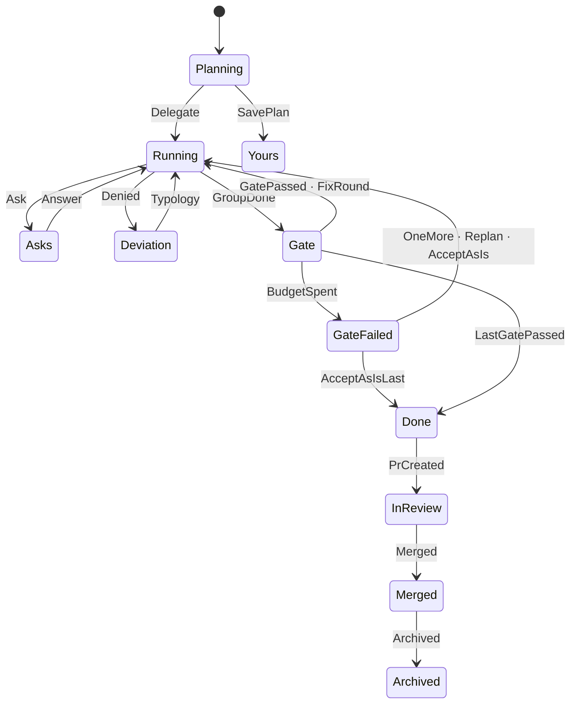

# arch-session

The session engine (HANDOFF §2; spec §6, §8, §11; issue #47). A plan becomes a session at
**Accept**; the **scheduler** then runs its **groups** one at a time, one Claude Code run per
**element** confined by the tool layer ([arch-driver](arch-driver.md#the-tool-layer)); each group
ends with its **gate** (the project's commands, `arch check`, the **judge**); a failed gate gets 2
**fix rounds**, then the four-door question. The CLI that drives it is #48.

| term | what |
|---|---|
| element | one planned change: an intention, a site, the files it may write (`plan.toml`) |
| group | elements that do not depend on each other; one gate each |
| gate | the group's commands (`sh -c` in the worktree), `arch check`, the judge |
| judge | a fresh, read-only driver call returning `pass`/`fail` and a reason per element (ADR 0013) |
| cursor | where the scheduler stands, in `session.toml` (ADR 0015) |

## State machine

One table of legal edges (`machine::TABLE`) over `arch_facts::SessionState`; every change goes
through `machine::next`, and anything else is `Error::IllegalTransition`.



## Core shaper

`shape(plan, test_command)`: groups are the topological layers over `depends_on` (group n holds
the elements whose dependencies all sit in earlier groups), plan order kept inside a layer, and
every group gets `Gate { commands: [test_command], check, judge, fix_rounds: 2 }`. A cycle or an
unknown dependency is an error.

| plan | groups |
|---|---|
| chain E1 → E2 → E3 | E1 · E2 · E3 |
| diamond E1 → E2, E3 → E4 | E1 · E2 E3 · E4 |
| independent E1 … E4 | E1 E2 E3 E4 |

## Accept

`accept(repo, store, id, planner_thread, options)`: the draft from the cache (shaped if it has no
groups), branch `arch/<id>` from HEAD, worktree `<parent>/<repo>-w<n>` (lowest free `n`; parent
configurable, default the repo's parent), then `plan.toml`, `thread.jsonl` (planner thread first,
then arch's `accepted` line) and `session.toml`, committed as `chore(arch): plan <name>` with an
`Arch-Session` trailer; the draft leaves the cache. A failure after the worktree exists removes it
and the branch. Without `delegate` the session is a locked `you` session (Yours).

## The engine

`Engine::open(worktree, id, driver, project, options)` reads `session.toml` and `plan.toml`;
`run()` goes until the session needs a person or is done; `answer`, `decide_deviation` and
`decide_gate` settle what it waits on and run on. The record is written after every step and the
session folder is committed (`chore(arch): <name> · <state>`) whenever `run` stops, so each call
can be its own process.

```
run()  Running ─ todo[0] ─▶ element turn ─┬─ mcp__arch__ask called ─▶ Asks       ◀─ answer()
                                          ├─ scope denial ─────────▶ Deviation  ◀─ decide_deviation()
                                          └─ done: next element
       Running, todo empty ─▶ Gate: commands · arch check · judge
                                ├─ pass ─▶ next group, or Done
                                ├─ fail, rounds left ─▶ Running (failing elements resumed)
                                └─ fail, budget spent ─▶ GateFailed + four-door Ask ◀─ decide_gate()
```

- **Element turn.** `tool_layer::config::write_context` writes the hooks and MCP config under
  `.arch/cache/driver/<element>/`, the context pack goes next to them (`pack.md`), and the driver
  runs with `Task.tools = Read Edit Write Glob Grep Bash` and arch's four MCP tools approved. The
  first turn starts a driver session (its id goes into `session.toml` before the first event);
  answers, typologies and fix rounds resume it (arch-design#33). The thread gets the filtered
  stream: text, tool calls (one-line input), tool results (first line), the result; not the start
  or hook events.
- **Asks.** A call to `mcp__arch__ask` in the turn's stream (the tool itself writes the `Ask`
  entry). `answer(answers)` writes them as your message and resumes the element.
- **Deviation.** A `Denial` record written during the turn whose reason is a scope denial
  (`denial::cause`; stale and command denials are not deviations). `decide_deviation`: back on
  the plan · update the plan (the denied paths join the element's files in `plan.toml`) · not this
  change; each resumes the element with a message saying so.
- **Gate.** One `GateOutput` record per command and for `arch check` (exit 1 when something
  blocks, 2 when the check itself failed), the output's sha256 as the witness. Then the judge: the
  fixed prompt `prompts/judge.md` with the group's elements, the gate output and the diff since the
  base, tools `Read Glob Grep`, `--json-schema` `{verdicts: [{element, verdict, reason}]}` (no
  field for code); one `JudgeVerdict` record each, and an element the answer misses fails.
- **Fix rounds.** The failing elements are the judge's fails; when only a command or the check
  failed, the whole group. Each is resumed with the judge's reason, the failing output and the
  person's hint. Budget: `Gate.fix_rounds` plus one per "one more round".
- **Four doors.** `decide_gate(Door::OneMore { hint })` runs one more round;
  `Door::AcceptAsIs { reason, by }` writes an `Override` record and moves on (next group or Done);
  take over and re-plan are #49 (`Error::NotYet`).

`arch check` and the facts come through `arch_session::Project`, which `arch_api::ArchProject`
implements (this crate may not depend on arch-analyze). Without facts the element runs without a
pack and the thread says so.

## Tests

- `cargo test -p arch-session`: the transition table (every edge of the diagram, every other pair
  illegal), the shaper (chain, diamond, independent, cycle, unknown dependency), the denial
  causes, the judge's schema and parsing.
- `tests/accept.rs`: Accept on a temp repo (branch, worktree, three files, one commit; `-w2`;
  no draft; taken branch; cycle).
- `tests/run.rs`, with the replay double over the recorded turns of
  `crates/arch-driver/tests/fixtures/`: 4 elements, 1 gate, pass → Done; a fail → one fix round →
  pass; two fails → GateFailed with the four doors, then one more round; accept as is; a failing
  command sends the group back; `arch check` blocking; two groups; ask → answer; scope vs stale
  denial → update the plan; an agent dying mid-turn; the pack handed to elements and judge.
- `tests/pack.rs`: the context-pack snapshots on the smallsvc fixture facts.
- `crates/arch-api/tests/project.rs`: the port over the real `check()` and analyzer.
