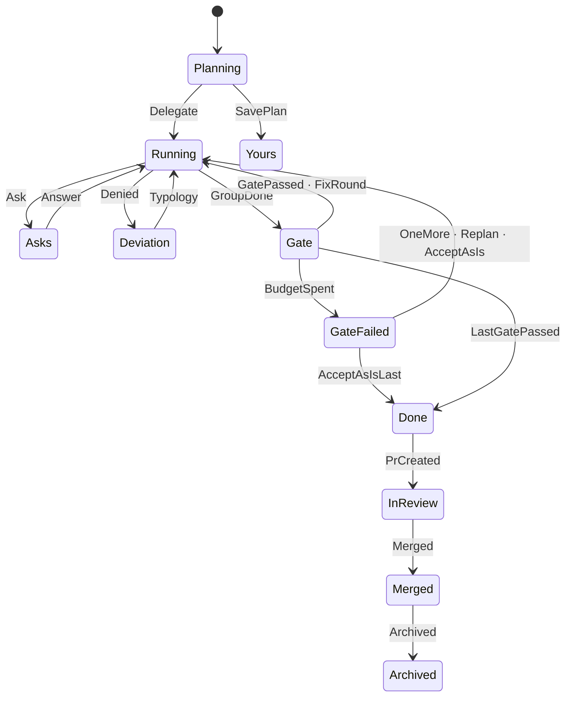
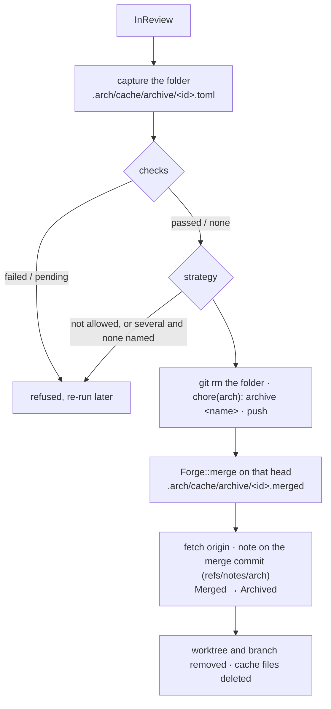

# arch-session

The session engine (HANDOFF §2; spec §6, §8, §11; issue #47). A plan becomes a session at
**Accept**; the **scheduler** then runs its **groups** one at a time, one Claude Code run per
**element** confined by the tool layer ([arch-driver](arch-driver.md#the-tool-layer)); each group
ends with its **gate** (the project's commands, `arch check`, the **judge**); a failed gate gets 2
**fix rounds**, then the four-door question. `arch session …` drives it from the CLI
([The CLI](#the-cli), #48).

| term | what |
|---|---|
| element | one planned change: an intention, a site, the files it may write (`plan.toml`) |
| group | elements that do not depend on each other; one gate each |
| gate | the group's commands (`sh -c` in the worktree), `arch check`, the judge |
| judge | a fresh, read-only driver call returning `pass`/`fail` and a reason per element (ADR 0013) |
| cursor | where the scheduler stands, in `session.toml` (ADR 0015) |

## State machine

One table of legal edges (`machine::TABLE`) over `arch_facts::SessionState`; every change goes
through `machine::next`, and anything else is `Error::IllegalTransition`.



## Core shaper

`shape(plan, test_command)`: groups are the topological layers over `depends_on` (group n holds
the elements whose dependencies all sit in earlier groups), plan order kept inside a layer, and
every group gets `Gate { commands: [test_command], check, judge, fix_rounds: 2 }`. A cycle or an
unknown dependency is an error.

| plan | groups |
|---|---|
| chain E1 → E2 → E3 | E1 · E2 · E3 |
| diamond E1 → E2, E3 → E4 | E1 · E2 E3 · E4 |
| independent E1 … E4 | E1 E2 E3 E4 |

## Accept

`accept(repo, store, id, planner_thread, options)`: the draft from the cache (shaped if it has no
groups), branch `arch/<id>` from HEAD, worktree `<parent>/<repo>-w<n>` (lowest free `n`; parent
configurable, default the repo's parent), then `plan.toml`, `thread.jsonl` (planner thread first,
then arch's `accepted` line) and `session.toml`, committed as `chore(arch): plan <name>` with an
`Arch-Session` trailer; the draft leaves the cache. A failure after the worktree exists removes it
and the branch. Without `delegate` the session is a locked `you` session (Yours).

## The engine

`Engine::open(worktree, id, driver, project, options)` reads `session.toml` and `plan.toml`;
`run()` goes until the session needs a person or is done; `answer`, `decide_deviation` and
`decide_gate` settle what it waits on and run on. The record is written after every step and the
session folder is committed (`chore(arch): <name> · <state>`) whenever `run` stops, so each call
can be its own process.

```
run()  Running ─ todo[0] ─▶ element turn ─┬─ mcp__arch__ask called ─▶ Asks       ◀─ answer()
                                          ├─ scope denial ─────────▶ Deviation  ◀─ decide_deviation()
                                          └─ done: next element
       Running, todo empty ─▶ Gate: commands · arch check · judge
                                ├─ pass ─▶ next group, or Done
                                ├─ fail, rounds left ─▶ Running (failing elements resumed)
                                └─ fail, budget spent ─▶ GateFailed + four-door Ask ◀─ decide_gate()
```

- **Element turn.** `tool_layer::config::write_context` writes the hooks and MCP config under
  `.arch/cache/driver/<element>/`, the context pack goes next to them (`pack.md`), and the driver
  runs with `Task.tools = Read Edit Write Glob Grep Bash` and arch's four MCP tools approved. The
  first turn starts a driver session (its id goes into `session.toml` before the first event);
  answers, typologies and fix rounds resume it (arch-design#33). The thread gets the filtered
  stream: text, tool calls (one-line input), tool results (first line), the result; not the start
  or hook events.
- **Asks.** A call to `mcp__arch__ask` in the turn's stream (the tool itself writes the `Ask`
  entry). `answer(answers)` writes them as your message and resumes the element.
- **Deviation.** A `Denial` record written during the turn whose reason is a scope denial
  (`denial::cause`; stale and command denials are not deviations). `decide_deviation`: back on
  the plan · update the plan (the denied paths join the element's files in `plan.toml`) · not this
  change; each resumes the element with a message saying so.
- **Gate.** One `GateOutput` record per command and for `arch check` (exit 1 when something
  blocks, 2 when the check itself failed), the output's sha256 as the witness. Then the judge: the
  fixed prompt `prompts/judge.md` with the group's elements, the gate output and the diff since the
  base, tools `Read Glob Grep`, `--json-schema` `{verdicts: [{element, verdict, reason}]}` (no
  field for code); one `JudgeVerdict` record each, and an element the answer misses fails.
- **Fix rounds.** The failing elements are the judge's fails; when only a command or the check
  failed, the whole group. Each is resumed with the judge's reason, the failing output and the
  person's hint. Budget: `Gate.fix_rounds` plus one per "one more round".
- **Four doors.** `decide_gate(Door::OneMore { hint })` runs one more round;
  `Door::AcceptAsIs { reason, by }` writes an `Override` record and moves on (next group or Done);
  take over and re-plan are #49 (`Error::NotYet`).

`arch check` and the facts come through `arch_session::Project`, which `arch_api::ArchProject`
implements (this crate may not depend on arch-analyze). Without facts the element runs without a
pack and the thread says so.

## The planner

`arch_session::planner`, shaped like the judge: the fixed prompt `prompts/planner.md` with the
intention, tools `Read Glob Grep` in the repository (no worktree yet), the repository's context
pack, `--json-schema {elements: [{intention, site, files, depends_on}]}`. `depends_on` names
earlier elements by label (`E1`). The answer becomes a draft: ids derived (ADR 0021), labels by
position, the labels turned into ids, groups shaped. `--plan plan.toml` gives the same elements by
hand and skips the driver:

```toml
[[element]]
intention = "add Refund to the domain"
site = "src/domain/refund.rs"
files = ["src/domain/refund.rs"]

[[element]]
intention = "an in-memory Refunds adapter"
site = "src/adapters/memory/refunds.rs"
files = ["src/adapters/memory/refunds.rs"]
depends_on = ["E1"]
```

## Review and merge

`review::pr(worktree, id, forge, base)` opens the request: title the session's name, the body
drafted from the plan (an element table with the last judge verdict), the thread's gate lines, the
overrides and an `Arch-Session` line. `Forge::create_pr` pushes the branch first (ADR 0017). Then
Done → InReview, committed in the session folder. An open request for the branch is reused, so a
retry is safe.

`review::merge(repo, id, worktree, forge, strategy)`:



- **The folder leaves the branch before the merge** so main's tree never holds it (ADR 0003). One
  honest consequence: the merged head is one commit past the reviewed one, and a repo that requires
  checks refuses the merge until they pass on it. `merge` says so and can be run again.
- **Every step can be re-run.** The capture waits in the cache, so a refused merge loses nothing;
  once the forge has merged, the merge commit waits there too until the note is written.
- **A merge the forge calls "not mergeable" is retried** after 1, 2, 4 and 8 s (`review::SETTLE`):
  right after the archive commit's push GitHub is still computing mergeability and answers 405
  (seen in the real run). After that, `merge` says so and can be run again.
- **The strategy is the repo's** (ADR 0016): the only one it allows, or the one named with
  `--strategy` among those it allows. GitHub has no default, so with several the person names one.
- **The note is on the merge commit the forge reports** and is not pushed: pushing
  `refs/notes/arch` is open in arch-design#19. Until it is decided the archive lives on the
  machine that merged. The archive's `session.toml` reads `archived`, and its thread ends with the
  merge line.
- A request merged outside arch is refused for now: the forge's `Request` does not carry the merge
  commit.

## The CLI

`arch session <verb>`, each verb one `arch-api` method (milestone 6 serves them over JSON-RPC and
MCP unchanged). Any path inside the repository or one of its worktrees works (`--repo`, default
`.`); a session is found through `git worktree list` (branch `arch/<id>`), then the merge cache,
then the drafts, then the notes.

| verb | arch-api | state after |
|---|---|---|
| `new "<intention>" [--plan plan.toml] [--delegate]` | `session_new` | Planning (the draft in the cache); with `--delegate`, wherever the run stops |
| `accept <id> [--delegate]` | `session_accept` | Yours, or wherever the run stops |
| `run <id>` | `session_run` | wherever the run stops (after a crash, ADR 0015) |
| `status <id> [--format json]` | `session_status` | — |
| `answer <id> "<answer>"…` | `session_answer` | wherever the run stops |
| `decide <id> one-more [--hint …] \| accept --reason … [--by …]` | `session_decide` | the gate's doors |
| `decide <id> back-on-plan \| update-plan \| not-this-change` | `session_decide` | a deviation's typologies |
| `pr <id> [--base <branch>]` | `session_pr` | InReview |
| `merge <id> [--strategy merge\|squash\|rebase]` | `session_merge` | Archived |

```
$ arch session new "add a refund flow" --plan plan.toml
plan 3c9e1f0a · 4 element(s), 1 group(s)
  E1 5d4353d6  add Refund to the domain         src/domain/refund.rs
  …
draft in the cache · arch session accept 3c9e1f0a --delegate
$ arch session accept 3c9e1f0a --delegate
accepted · branch arch/3c9e1f0a · worktree ../smallsvc-w1
running group 1/1 · E1 E2 E3 E4 done
gate · group 1 · cargo test --workspace ✓ · arch check ✓ · judge 4/4 pass
done · arch session pr 3c9e1f0a to open the PR
$ arch session pr 3c9e1f0a
PR #12 · https://github.com/o/r/pull/12 · opened, in review
$ arch session merge 3c9e1f0a --strategy merge
merged PR #12 (merge) as 6dcb09b5b578 · archived to refs/notes/arch (9 files)
removed worktree ../smallsvc-w1 and branch arch/3c9e1f0a
```

Between `new` and `accept` the planner's thread waits in the cache next to the draft
(`.arch/cache/drafts/<id>.thread.jsonl`, ADR 0020); Accept puts it first in `thread.jsonl` and
deletes it.

**Config**: flags over the environment for now (ADR 0023 brings a Settings tab).

| flag | env | default |
|---|---|---|
| `--test-command` | `ARCH_TEST_COMMAND` | `cargo test --workspace` |
| `--worktree-parent` | `ARCH_WORKTREE_PARENT` | the repository's parent (ADR 0011) |
| `--model` | `ARCH_MODEL` | Claude Code's |
| `--judge-model` | `ARCH_JUDGE_MODEL` | Claude Code's |
| `--max-turns` | `ARCH_MAX_TURNS` | none |
| — | `ARCH_DRIVER` | `claude-code`; `replay:<dir>` plays `<dir>/*.jsonl`, acting ([arch-driver](arch-driver.md#the-trait)) |
| — | `ARCH_FORGE` | `github` (from `origin`); `fake:<dir>` answers from `<dir>/recorded.json` ([arch-forge](arch-forge.md#transport)) |

## Real run

Opt-in and by hand, never in CI: real Claude Code (your login) and real GitHub (your token, see
[arch-forge](arch-forge.md#repository-and-token)). `experiments/session-real.sh <owner>/<repo>`
copies smallsvc into a scratch directory, creates the private GitHub repository when it does not
exist, pushes it, and runs `new --delegate`, `pr` and `merge --strategy merge`, then prints the
status and the note. It costs one planner call, one call per element, and one judge call per gate.

```sh
cargo build -p arch-cli
experiments/session-real.sh LEBOCQTitouan/arch-scratch "add a refund flow"
```

## Tests

- `cargo test -p arch-session`: the transition table (every edge of the diagram, every other pair
  illegal), the shaper (chain, diamond, independent, cycle, unknown dependency), the denial
  causes, the judge's schema and parsing.
- `tests/accept.rs`: Accept on a temp repo (branch, worktree, three files, one commit; `-w2`;
  no draft; taken branch; cycle).
- `tests/run.rs`, with the replay double over the recorded turns of
  `crates/arch-driver/tests/fixtures/`: 4 elements, 1 gate, pass → Done; a fail → one fix round →
  pass; two fails → GateFailed with the four doors, then one more round; accept as is; a failing
  command sends the group back; `arch check` blocking; two groups; ask → answer; scope vs stale
  denial → update the plan; an agent dying mid-turn; the pack handed to elements and judge.
- `tests/pack.rs`: the context-pack snapshots on the smallsvc fixture facts.
- `crates/arch-api/tests/project.rs`: the port over the real `check()` and analyzer.
- `cargo test -p arch-session --lib`: the planner (labels to ids, an unknown label, the closed
  schema, `plan.toml` refusing unknown keys), the strategy rule, the PR description.
- `crates/arch-cli/tests/session.rs`, the binary on a copy of smallsvc with a local bare `origin`,
  `ARCH_DRIVER=replay:` and `ARCH_FORGE=fake:` (milestone 5's acceptance): `new --plan` · `accept
  --delegate`, with 4 elements written and committed through `arch hook` and `arch mcp`, 1 gate, the judge 4/4; then 4 commits with `Arch-Element` and
  `Arch-Session`, `pr` (the branch on `origin`), `merge` (the folder off the branch, the note on
  the merge commit with `session.toml` archived, worktree and branch gone, `status` from the
  notes). Also: the planner and `new --delegate` in one process over two groups; an ask answered
  in a second process; a gate failed three times, then `decide one-more`; `accept` without
  `--delegate`; `merge` refused on red checks, then for naming no strategy among three, then run
  again with `--strategy squash` from the first attempt's capture, through one 405 "not
  mergeable" retried.
