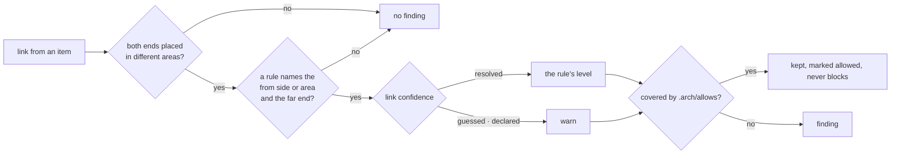

# arch-views

Pure functions over facts and the `.arch/` files. Depends on `arch-facts` only; its tests never run
the analyzer.

## Dependency rules (`check_rules`)

`check_rules(facts, areas, rules, allows) → Report` is what `arch check` reports (issue #5).

- **Placement.** The first area in `areas.toml` whose path patterns match the item's file. An item
  no area claims (the crate root, integration tests) has no column and no rule applies
  (ADR 0025, 0027).
- **What is a dependency.** Every link kind except `tests`; links from `#[cfg(test)]` code are
  ignored (ADR 0027).
- **`externals`.** A table, an I/O external or a driven I/O port. Libraries (kind `crate`, `pub`)
  do not count. Open: whether logging is I/O (arch-design issue 28).
- **Confidence** (ADR 0009). Only a `resolved` link keeps the rule's level.
- **Allows.** Matched on rule text (`domain must not depend-on driven`), site
  (`<file>::<Type>::<fn>`, an item id, or the witness's `file:line`) and, when the allow names
  one, the target or a parent of it.
- Findings are sorted by site, target, rule; each carries its link's witness and `origin: core`.

## Proposed areas (`propose_areas`)

`propose_areas(facts) → Areas` is the `areas.toml` that `arch init` writes (ADR 0027, 0028, 0029).

| step | rule |
|---|---|
| areas | one per top-level module of the root crate, a single file included; the crate root has none |
| split | a module whose direct children mix driving and driven becomes one area per child |
| side | first match: holds an entry → driving; touches an I/O external, or implements a unit trait an I/O-touching module implements → driven; else domain. Non-test code only |
| order | byte-wise rank of the name within its side, from 1 |
| rule | hexagon when the unit has an entry, layers (order only) otherwise |

On the analyzer's facts for the two fixtures it reproduces 10 of 11 rows of each table in ADR 0029.
The two misses are open design questions, implemented as the ADR text says: smallsvc `app` computes
driven because logging counts as I/O (arch-design issue 28); zero2prod `startup` computes domain
because registering routes is not holding an entry (arch-design issue 30).

Not here yet: lints (names pending, issue #13), layouts, fold, Reach, overlays, impact (issue #4).
